## Table of Contents
- [Governing Equations](#governing-equations)
- [Domain](#domain)
- [Initial Conditions](#initial-conditions)
- [Boundary Conditions](#boundary-conditions)
- [Numerical Methods](#numerical-methods)
    - [Equations](#equations)
    - [Numerical Interpolation](#numerical-interpolation)
    - [Numerical Differentiation](#numerical-differentiation)
    - [Compute intermediate Variables](#compute-intermediate-variables)
    - [Compute the right hand side of the semi-discretized equations](#compute-the-right-hand-side-of-the-semi-discretized-equations)
    - [Time Stepping](#time-stepping)

# Governing Equations

The shallow water equations are:

$$ \frac{\partial{\vec{V}}}{\partial t} + \vec{\eta} \times P \vec{V} + \nabla \left( P + \frac{1}{2}\vec{V} \cdot \vec{V} \right) = 0$$

$$ \frac{\partial{P}}{\partial t} + \nabla \cdot \left( P \vec{V} \right) = 0$$

where the velocity $(\vec{V})$ is two dimensional and therefore potential vorticity $(\vec{\eta})$ only has a component in the out of plane (normal) direction:

$$ \vec{V} = u \ \hat{i} + v \ \hat{j} $$

$$ \vec{\eta} = \frac{\nabla \times \vec{V}}{P} = \frac{ \frac{\partial v}{\partial x} - \frac{\partial u}{\partial y} }{P} \ \hat{k} $$

# Domain

The equations are discretized on a two dimensional Cartesian domain $\Omega = \left\{ (x,y) : 0 \leq x \leq L_x,  0 \leq y \leq L_y \right\}$ .

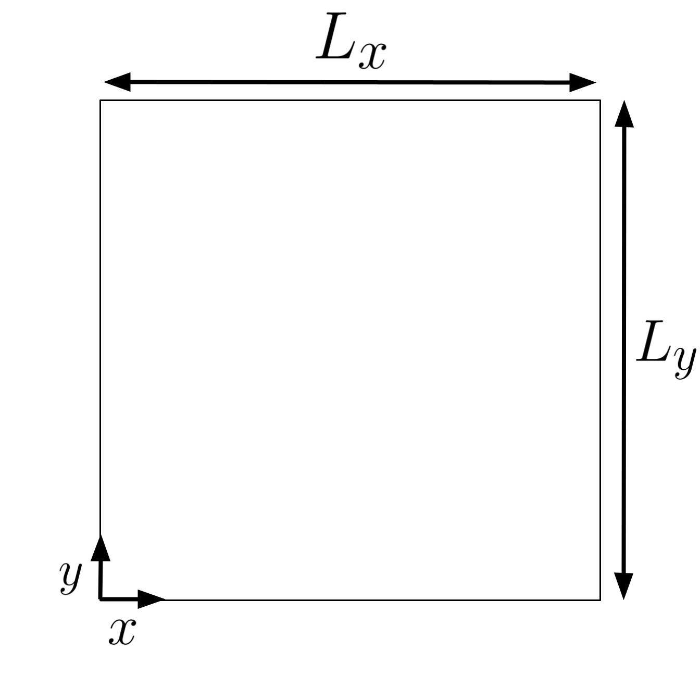

The domain is discretized using cartesian mesh with a uniform step size in each direction. The step size (dx, dy) and number of cells in each direction (Nx, Ny) can be varied independently. Their values then implicitly sets the length of the domain in each direction $(L_x = Nx * dx, \ L_y = Ny * dy)$. 

*Typically when we run the code the step size in each direction is kept at a default value of dx=dy=$10,000$ and the user changes the number of cells (Nx, Ny) the vary the problem size.*  

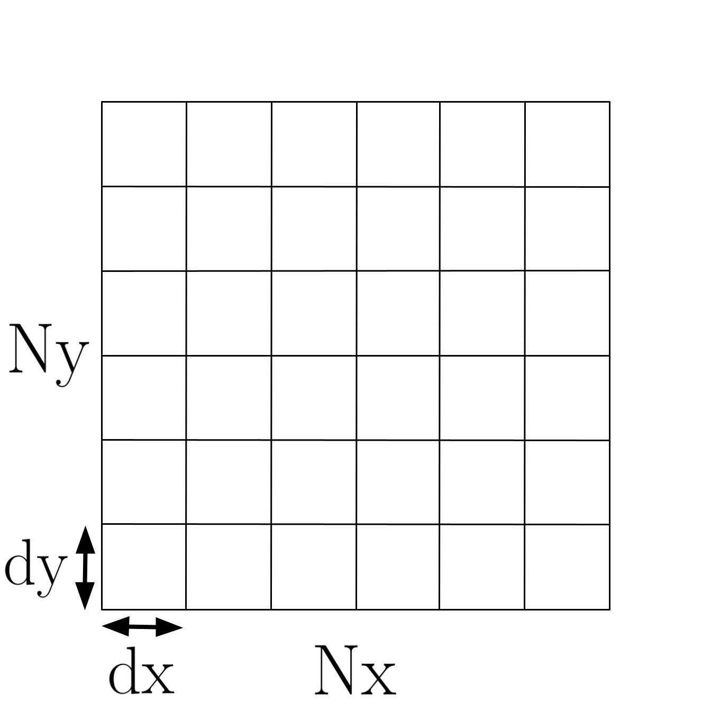

The figure below shows where the variables are saved on the mesh. The pressure is saved on the nodal points. The x velocity component $(u)$ is saved on the y faces (faces with normal vector $\hat{j}$). The y velocity component $(v)$ is saved on the x faces (faces which have a normal vector of $\hat{x}$). The pressure $(P)$ is saved on the nodal points and the potential vorticity $(\eta)$ is saved on the cell centers. The legend shows the color and symbol associated with each location. This color and symbol notation will be used to signify variable location throughout this documentation.

The indexing scheme used for the nodal, face centered, and cell centered values varies depending on the implementation. The indexing scheme shown in the figure below is used in the AMReX versions of the mini-app. 

*Note that the user inputs the number of cells in each direction (Nx, Ny), hence the data structures used to store values at the nodal and face centered locations need to be allocated larger to accommodate the extra values.*

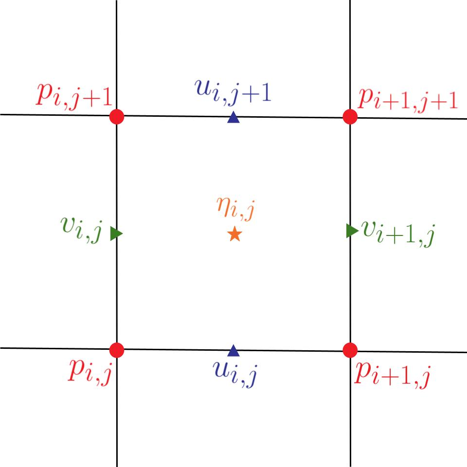

# Initial Conditions
An analytical initial condition is specified the velocity and pressure.

The velocity is initialized using an analytical stream function. 

$$ \psi = A \sin(\xi_x) \sin(\xi_y) $$

where the amplitude is set to a default value of 
$$ A = 10^6 $$

and $\xi_x$ and $\xi_y$ are the spacial variables $x$ and $y$ transformed onto the interval $(0, 2\pi)$.

$$\xi_x = \frac{2\pi}{L_x}x $$

$$\xi_y = \frac{2\pi}{L_y}x $$

Then the initial velocity is set to:

$$ u_0 = -\frac{\partial \psi}{\partial y} $$

$$ v_0 = \frac{\partial \psi}{\partial x} $$

*Note: This is what is in the code but usually I see the stream function defined so that $u = \frac{\partial \phi}{\partial y}$ and $v = -\frac{\partial \phi}{\partial x}$}. I don't think it matters since either definition of the stream function automatically satisfies the two dimensional incompressible continuity equation. Just a note this is what most textbooks I have come across would call $-\psi$*

In the implementation the stream function $\psi$ is evaluated and saved at the cell centers, then the central finite difference is used to find $u$ and $v$ at the adjacent faces.

The initial pressure evaluated at all the nodal points using:

$$ P_0 =  \frac{\pi^2 A^2}{L_x^2} \left[ \cos(2 \xi_x) + \cos(2 \xi_y) \right] + 5000 $$ 

# Boundary Conditions
Periodic boundary conditions are applied in both the x and y directions. The specific implementation of how the boundary conditions are applied varies between different versions of the code in the SWM repository.

# Numerical Methods

## Equations
We are going to use an explicit method for time integration. So it is useful to put the governing equations into component form and move everything but the time derivatives to the right hand side of the equals sign:

$$ { \frac{\partial u}{\partial t} }= \eta P v - \frac{\partial}{\partial x} \left( P + \frac{1}{2} (u^2 + v^2) \right)$$

$$  { \frac{\partial v}{\partial t} } = -\eta P u - \frac{\partial}{\partial y} \left( P + \frac{1}{2} (u^2 + v^2) \right)$$

$$  \frac{\partial P}{\partial t} = -\frac{\partial}{\partial x}\left(Pu\right) - \frac{\partial}{\partial y} (Pv) $$

where:

$$ \eta = \frac{ \frac{\partial v}{\partial x} - \frac{\partial u}{\partial y} }{P} $$

Notice that several terms appear multiple times in the right hand of our governing equations. Rewriting the governing equations in terms of these intermediate variables gives:

$$ { \frac{\partial u}{\partial t} }= \eta \ c_u - \frac{\partial h}{\partial x} $$

$$  { \frac{\partial v}{\partial t} } = -\eta \ c_v - \frac{\partial h}{\partial y} $$

$$  \frac{\partial P}{\partial t} = -\frac{\partial c_u}{\partial x} - \frac{\partial c_v}{\partial y} $$

where:

$$ c_u = P u $$

$$ c_v = P v $$

$$ h = P + \frac{1}{2} (u^2 + v^2)  $$

$$ \eta = \frac{ \frac{\partial v}{\partial x} - \frac{\partial u}{\partial y} }{P} $$

## Numerical Interpolation 
Interpolation between the various locations where data is saved is required when evaluating the right intermediate variable and the right hand size of the governing equations. Linear interpolation is used throughout the code to do this. The figures below show how interpolation is done between for generic 2D variable $\phi_{i,j}$.

Node to X face
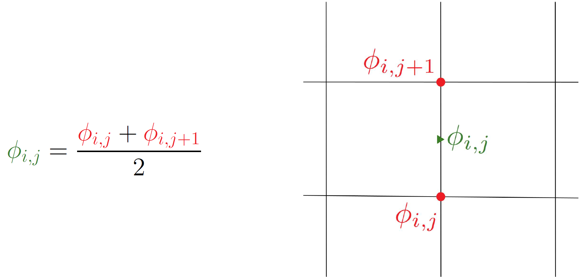
Node to Y face
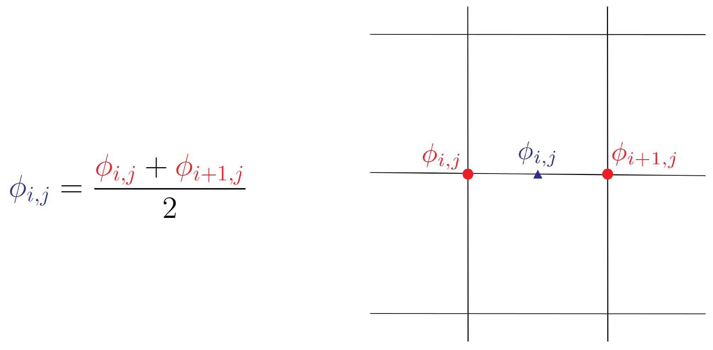
Node to Cell Center

X face to Node
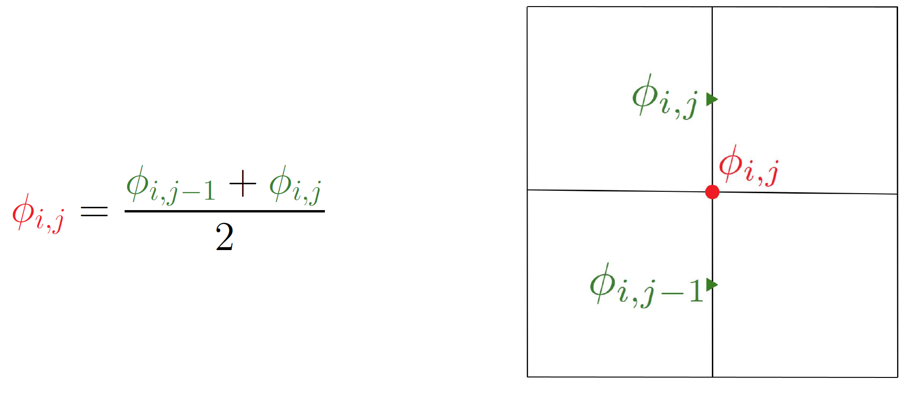
X face to Y face
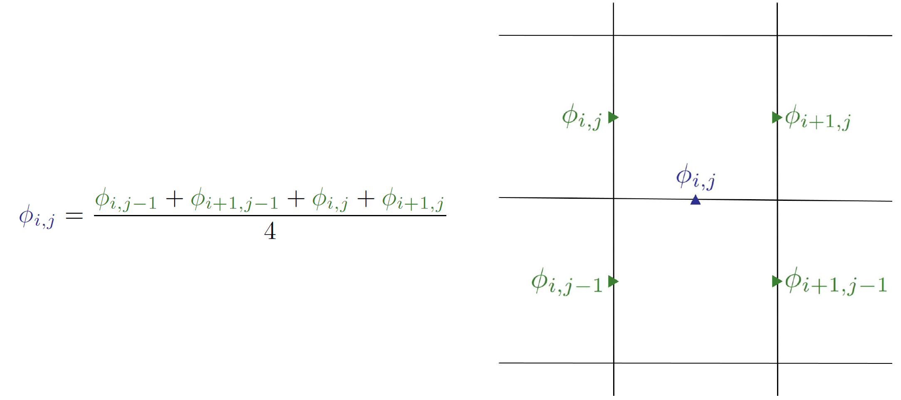
X face to Cell Center
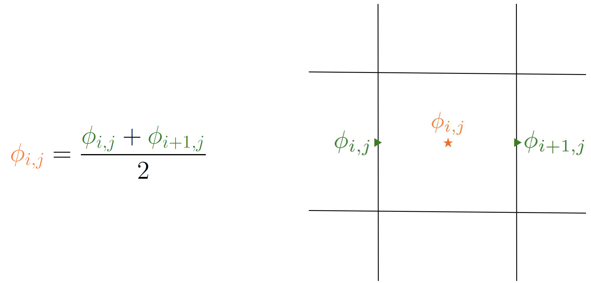

Y face to Node
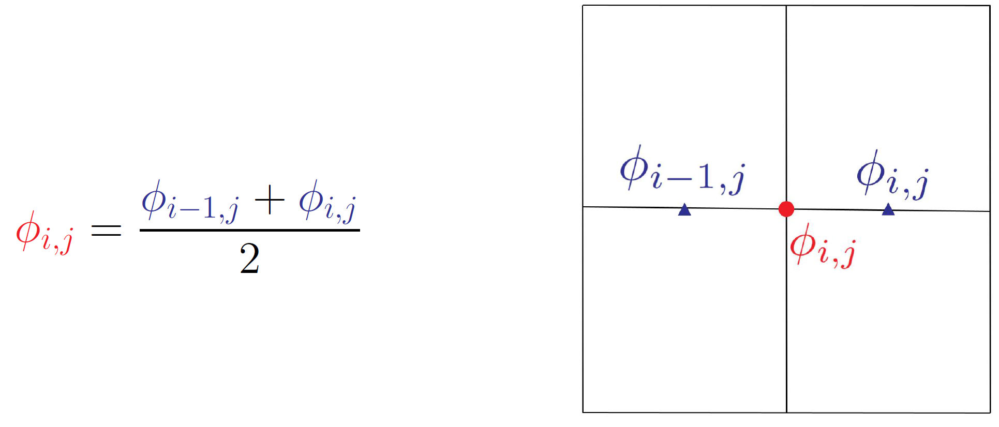
Y face to X face
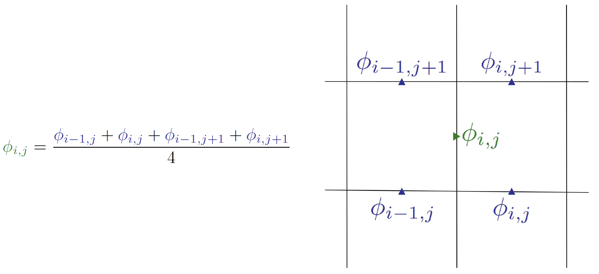
Y face to Cell Center
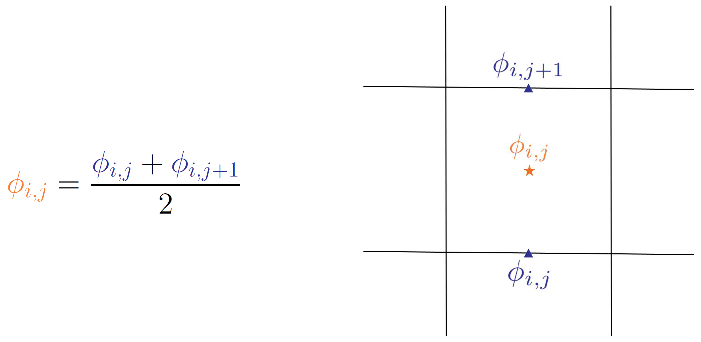

Cell Center to Node
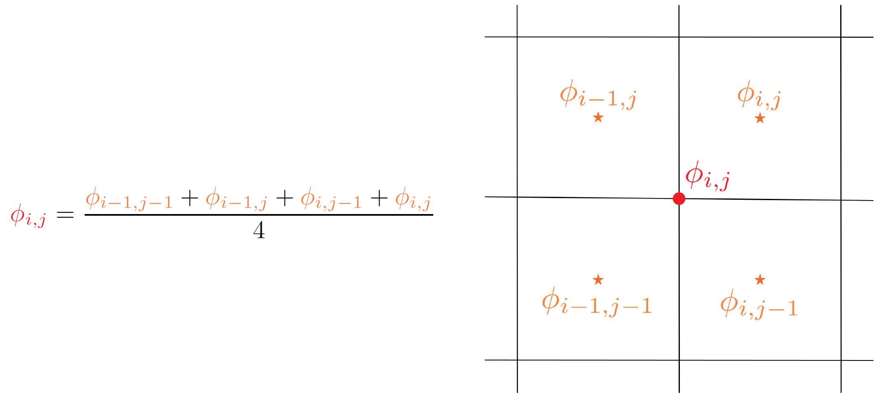
Cell Center to X face
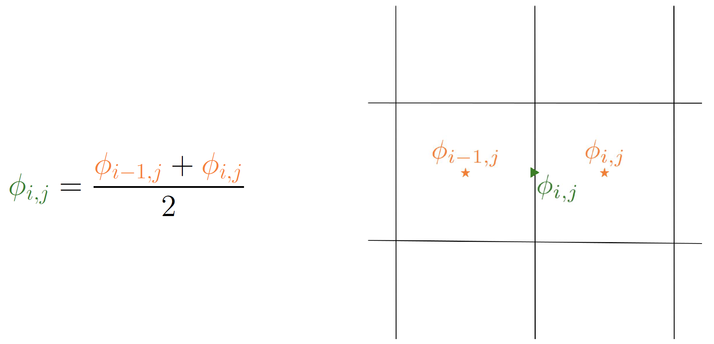
Cell Center to Y face
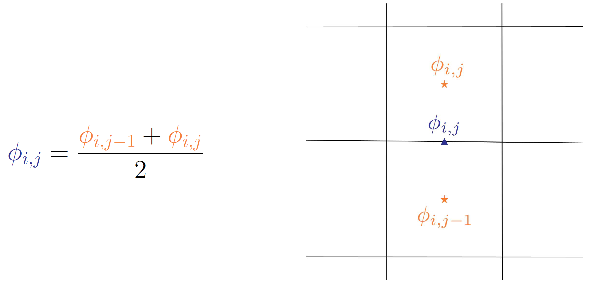

## Numerical Differentiation
Second order central finite differencing is used to compute the spatial derivatives. For example to find the derivative of a generic 2D variable $\phi_{i,j}$ with respect to the x direction:

$$ \frac{\partial \phi_{i,j}}{\partial x} = \frac{\phi_{i+1,j} - \phi_{i-1,j}}{dx} + \mathcal{O}(dx^2) $$

$$ \frac{\partial \phi_{i,j}}{\partial x} \approx \frac{\phi_{i+1,j} - \phi_{i-1,j}}{dx} $$

Likewise when differentiating with respect to y we get:

$$ \frac{\partial \phi_{i,j}}{\partial y} \approx \frac{\phi_{i,j+1} - \phi_{i,j-1}}{dy} $$

## Compute intermediate Variables
Now compute the intermediate variables that appear on the right hand side of our governing equations. When doing this we need to keeping in mind where each variable is stored and do the appropriate interpolation and numerical differentiation.

*Note: The figures that I have made use slightly different notation for the pressure velocity products that are used as intermediate variables. So $c_u\rvert_{i,j} = [Pu]_{i,j}$ and likewise $c_v\rvert_{i,j} = [Pv]_{i,j}$.

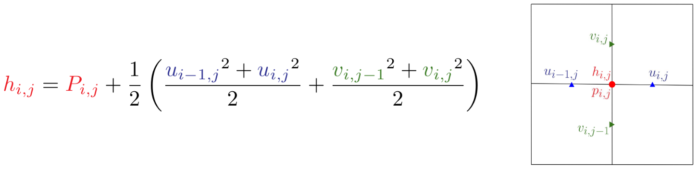

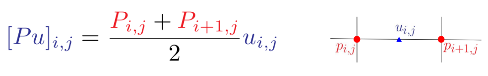

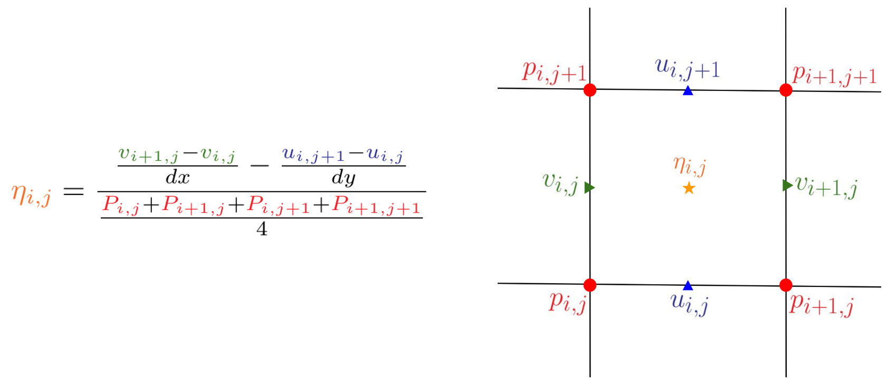

## Compute the right hand side of the semi-discretized equations:
Now that we have the intermediate variables computed we can compute the right hand side of our governing equations. Again doing the appropriate interpolation to the location of each of the primitive variables we are going to time advance.

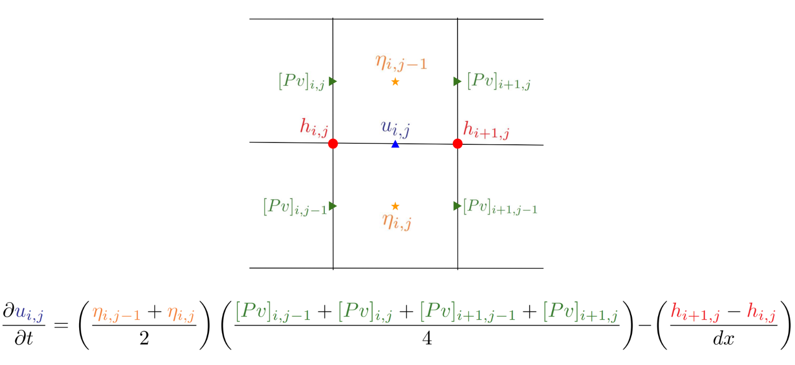

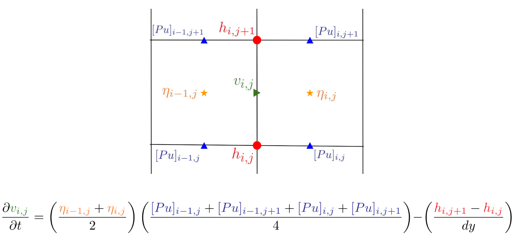

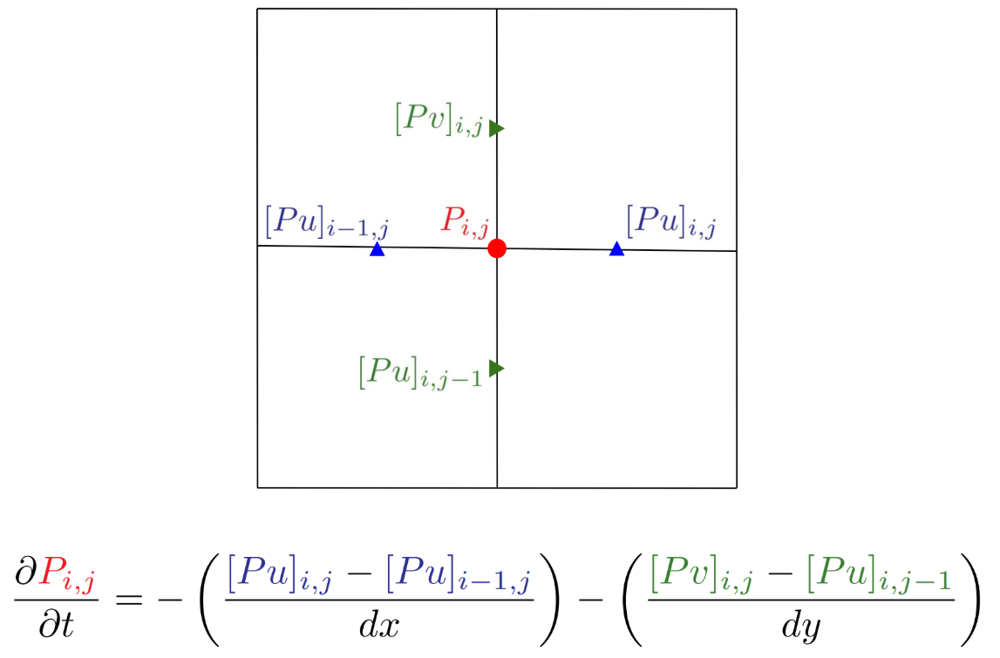

## Time Stepping
Explicit euler for the first time step.

TODO: Add documentation for subsequent time stepping using hard coded relaxation value.

